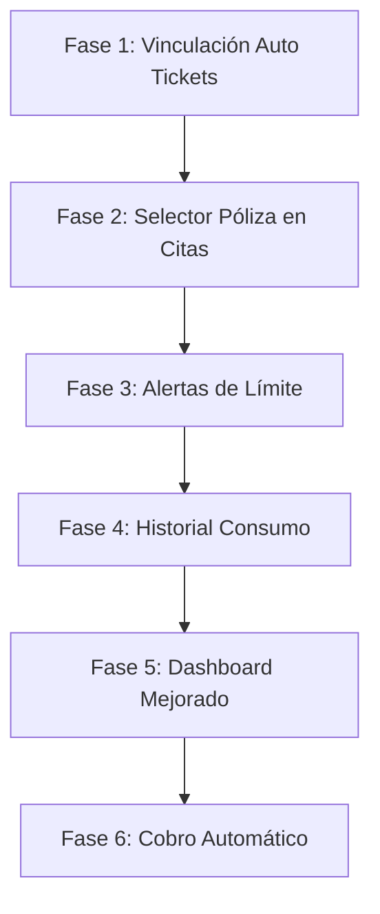

# 🛡️ Plan de Mejoras: Sincronización de Pólizas

Este documento describe las mejoras planificadas para integrar completamente el sistema de pólizas con los módulos de Tickets y Citas (Visitas).

---

## 📋 Resumen Ejecutivo

| Fase | Nombre | Prioridad | Complejidad | Tiempo Est. |
|------|--------|-----------|-------------|-------------|
| 1 | Vinculación Automática de Tickets | 🔴 Alta | Media | 2-3 hrs |
| 2 | Selector de Póliza en Citas | 🔴 Alta | Baja | 1-2 hrs |
| 3 | Alertas de Límite Excedido | 🟡 Media | Media | 3-4 hrs |
| 4 | Historial de Consumo Detallado | 🟡 Media | Media | 2-3 hrs |
| 5 | Dashboard de Pólizas Mejorado | 🟢 Baja | Alta | 4-5 hrs |
| 6 | Cobro Automático de Excedentes | 🟢 Baja | Alta | 3-4 hrs |

---

## 🔴 FASE 1: Vinculación Automática de Tickets a Pólizas

### Objetivo
Cuando un cliente crea un ticket (desde portal o admin), el sistema debe detectar automáticamente si tiene una póliza activa y vincularla.

### Archivos a Modificar
- `app/Http/Controllers/ClientPortal/PortalController.php` - Método `store()`
- `app/Http/Controllers/TicketController.php` - Método `store()`
- `app/Models/Ticket.php` - Evento `creating`

### Lógica de Implementación
```php
// En el evento creating del Ticket
if (!$ticket->poliza_id && $ticket->cliente_id) {
    $polizaActiva = PolizaServicio::where('cliente_id', $ticket->cliente_id)
        ->where('estado', 'activa')
        ->where('fecha_fin', '>=', now())
        ->first();
    
    if ($polizaActiva) {
        $ticket->poliza_id = $polizaActiva->id;
    }
}
```

### Criterios de Aceptación
- [ ] Al crear ticket desde portal, se vincula automáticamente la póliza activa del cliente
- [ ] Al crear ticket desde admin, se muestra dropdown de pólizas disponibles
- [ ] Si el cliente tiene múltiples pólizas, se usa la más reciente o se permite elegir

---

## 🔴 FASE 2: Selector de Póliza en Formulario de Citas

### Objetivo
Agregar un campo visual para vincular una cita a una póliza específica del cliente.

### Archivos a Modificar
- `resources/js/Pages/Citas/Form.vue` o similar
- `app/Http/Controllers/CitaController.php`
- Base de datos ya tiene `poliza_id` en `citas`

### Cambios en Frontend
```vue
<!-- Agregar después del selector de cliente -->
<div v-if="clientePolizas.length > 0">
    <label>Póliza Asociada</label>
    <select v-model="form.poliza_id">
        <option :value="null">Sin póliza (cobro normal)</option>
        <option v-for="poliza in clientePolizas" :value="poliza.id">
            {{ poliza.nombre }} - {{ poliza.folio }}
        </option>
    </select>
</div>
```

### Criterios de Aceptación
- [ ] Al seleccionar un cliente, se cargan sus pólizas activas
- [ ] Se puede elegir vincular la cita a una póliza o dejarla sin póliza
- [ ] Al completar la cita vinculada, se descuenta del contador de visitas

---

## 🟡 FASE 3: Alertas de Límite Excedido

### Objetivo
Notificar automáticamente cuando un cliente está cerca de agotar o ya agotó sus límites mensuales.

### Archivos a Crear/Modificar
- `app/Notifications/PolizaLimiteProximoNotification.php` (Nuevo)
- `app/Notifications/PolizaLimiteExcedidoNotification.php` (Nuevo)
- `app/Models/PolizaServicio.php` - Agregar método de verificación
- `app/Observers/PolizaServicioObserver.php` (Nuevo)

### Triggers de Notificación
| Evento | Destinatario | Canal |
|--------|--------------|-------|
| 80% tickets consumidos | Cliente + Admin | Email |
| 100% tickets consumidos | Admin | Email + Dashboard |
| Visita extra utilizada | Admin | Email |

### Lógica de Verificación
```php
public function verificarLimites(): void
{
    $porcentajeTickets = $this->porcentaje_tickets ?? 0;
    
    if ($porcentajeTickets >= 80 && $porcentajeTickets < 100) {
        $this->cliente->notify(new PolizaLimiteProximoNotification($this));
    }
    
    if ($porcentajeTickets >= 100) {
        // Notificar admin para cobro de excedentes
        User::role('super-admin')->first()
            ->notify(new PolizaLimiteExcedidoNotification($this));
    }
}
```

### Criterios de Aceptación
- [ ] Cliente recibe email al alcanzar 80% de tickets
- [ ] Admin recibe alerta cuando se excede el límite
- [ ] Las alertas no se envían repetidamente (control de envío único)

---

## 🟡 FASE 4: Historial de Consumo Detallado

### Objetivo
Crear un registro auditable de cada consumo de póliza (tickets y visitas).

### Archivos a Crear
- `database/migrations/create_poliza_consumos_table.php`
- `app/Models/PolizaConsumo.php`

### Estructura de la Tabla
```php
Schema::create('poliza_consumos', function (Blueprint $table) {
    $table->id();
    $table->foreignId('poliza_id')->constrained('polizas_servicio');
    $table->string('tipo'); // 'ticket', 'visita', 'hora'
    $table->morphs('consumible'); // Ticket o Cita
    $table->integer('cantidad')->default(1);
    $table->text('descripcion')->nullable();
    $table->foreignId('registrado_por')->nullable()->constrained('users');
    $table->timestamps();
});
```

### Vista en Admin
- Tabla con filtros por póliza, tipo, fecha
- Exportación a Excel
- Vinculación directa al ticket/cita consumido

### Criterios de Aceptación
- [ ] Cada consumo de ticket queda registrado con fecha y usuario
- [ ] Cada visita completada queda registrada
- [ ] Se puede ver el historial desde el detalle de la póliza
- [ ] Se puede exportar el historial para facturación

---

## 🟢 FASE 5: Dashboard de Pólizas Mejorado

### Objetivo
Crear un panel centralizado para monitorear el estado de todas las pólizas activas.

### Vista Principal
```
┌─────────────────────────────────────────────────────────────┐
│ 📊 Dashboard de Pólizas                                     │
├─────────────────────────────────────────────────────────────┤
│ ┌──────────┐  ┌──────────┐  ┌──────────┐  ┌──────────┐     │
│ │ 12       │  │ 3        │  │ 2        │  │ 1        │     │
│ │ Activas  │  │ Vencen   │  │ Excedidas│  │ Sin      │     │
│ │          │  │ Este Mes │  │          │  │ Actividad│     │
│ └──────────┘  └──────────┘  └──────────┘  └──────────┘     │
├─────────────────────────────────────────────────────────────┤
│ 🔴 Requieren Atención                                       │
│ ├─ Judith - Póliza Pyme Tech - 10/10 tickets (EXCEDIDA)    │
│ └─ Distribuidora Alfa - Vence en 5 días                    │
├─────────────────────────────────────────────────────────────┤
│ 📈 Consumo General del Mes                                  │
│ [████████████░░░░░░░░] 65% Tickets | [████░░░░░░] 40% Hrs  │
└─────────────────────────────────────────────────────────────┘
```

### Archivos a Crear/Modificar
- `resources/js/Pages/PolizaServicio/Dashboard.vue` (Mejorar)
- `app/Http/Controllers/PolizaServicioController.php` - Método `dashboard()`

### Criterios de Aceptación
- [ ] Vista rápida de pólizas críticas (excedidas, por vencer)
- [ ] Gráficos de consumo mensual agregado
- [ ] Acceso rápido a acciones (renovar, cobrar, contactar)

---

## 🟢 FASE 6: Cobro Automático de Excedentes

### Objetivo
Generar automáticamente cuentas por cobrar cuando se excedan los límites de la póliza.

### Archivos a Modificar
- `app/Models/PolizaServicio.php` - Métodos de registro de consumo
- `app/Models/CuentasPorCobrar.php`

### Lógica de Cobro
```php
public function registrarVisitaSitio(): void
{
    $this->increment('visitas_sitio_consumidas_mes');
    
    // Si excede el límite, generar cargo
    if ($this->visitas_sitio_consumidas_mes > $this->visitas_sitio_mensuales) {
        CuentasPorCobrar::create([
            'cliente_id' => $this->cliente_id,
            'cobrable_type' => PolizaServicio::class,
            'cobrable_id' => $this->id,
            'monto' => $this->costo_visita_sitio_extra,
            'concepto' => 'Visita Adicional - ' . now()->format('M Y'),
            'fecha_vencimiento' => now()->addDays(15),
        ]);
    }
}
```

### Criterios de Aceptación
- [ ] Al exceder visitas, se genera CxC automáticamente
- [ ] Al exceder tickets (si aplica), se genera CxC
- [ ] El admin puede configurar si el cobro es automático o manual
- [ ] El cliente puede ver los cargos pendientes en su portal

---

## 🔧 Orden de Implementación Sugerido



### Dependencias
- Fase 3 requiere que Fase 1 y 2 estén completas (para que haya consumos que alertar)
- Fase 4 puede implementarse en paralelo con Fase 3
- Fase 6 depende de que Fase 4 esté lista (para auditoría)

---

## 📝 Notas de Implementación

### Comando para Ejecutar Fase 1
```bash
# Modificar TicketController y PortalController
# Agregar lógica de vinculación automática
```

### Comando para Ejecutar Fase 2
```bash
# Modificar formularios de Citas
# Agregar endpoint para obtener pólizas de cliente
```

### Testing
Después de cada fase, verificar:
1. Crear ticket desde portal → Debe vincularse a póliza automáticamente
2. Crear cita desde admin → Debe poder seleccionar póliza
3. Verificar contadores de consumo
4. Revisar vista del cliente en portal

---

## ✅ Estado Actual

| Fase | Estado | Fecha Completado |
|------|--------|------------------|
| 1 | ✅ Completado | 2026-01-17 |
| 2 | ✅ Completado | 2026-01-17 |
| 3 | ⏳ Pendiente | - |
| 4 | ⏳ Pendiente | - |
| 5 | ⏳ Pendiente | - |
| 6 | ⏳ Pendiente | - |

---

*Documento creado el 2026-01-17*
*Última actualización: 2026-01-17*
